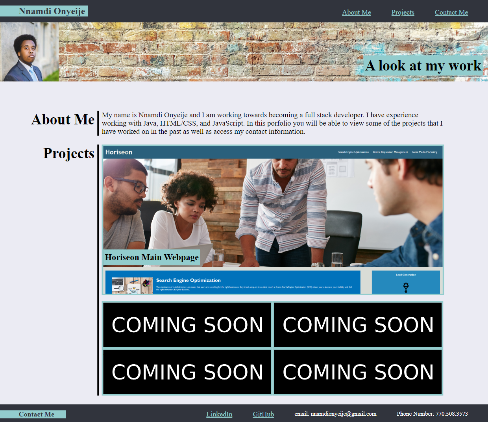

# Web-App-Portfolio

## Description

The purpose of this project is to create a coding portfolio page. Everything has been coded from scratch in order to give potential employers an example of my HTML/CSS skills.

## Screenshot

## Usage

Click on the images on the page to be taken to completed projects I have made.

## Credits

N/A

## Link

https://nnamdionyeije.github.io/Web-App-Portfolio/
